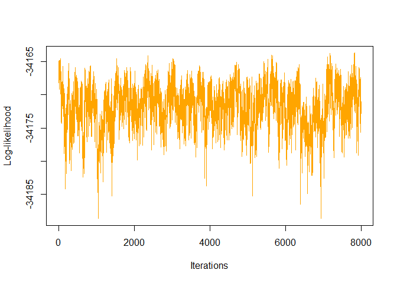
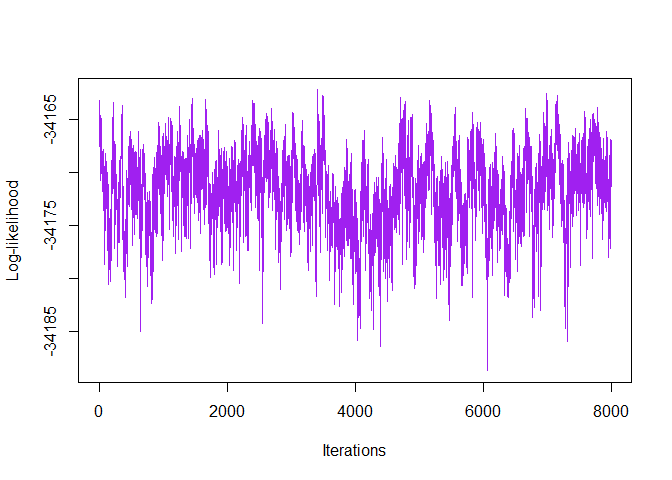
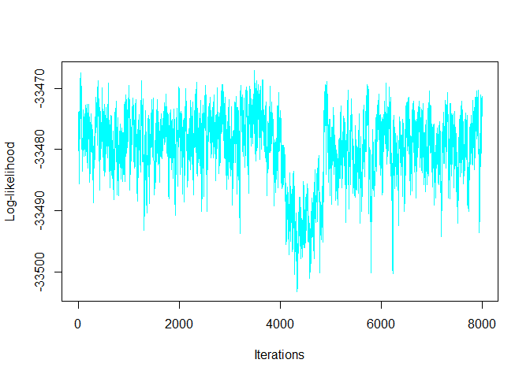

<!-- README.md is generated from README.Rmd. Please edit that file -->

# RGM

<!-- badges: start -->

[](https://github.com/bitansa/ReciprocalGraphicalModels/actions/workflows/R-CMD-check.yaml)
<!-- badges: end -->

## Intended use of the package

The RGM R package addresses a critical challenge in Mendelian
randomization (MR) studies by offering a comprehensive solution. While
MR has been instrumental in establishing causal relationships between
exposures and outcomes, it typically focuses on the effects of single
exposures on specific outcomes. However, biological systems are often
complex, with interdependent outcomes influenced by numerous factors.
RGM introduces a network-based approach to MR, allowing for exploration
of the broader causal landscape. By leveraging network structures, RGM
enables the construction of causal graphs that capture interactions
between response variables and between responses and instrument
variables.

RGM supports two models: Model 1, where the relationship is described by
Y=AY+E, and Model 2, where it is Y=AY+BX+E. For Model 1, RGM
accommodates individual-level data as well as summary-level data. For
Model 2, RGM supports individual-level data and two types of
summary-level data. This adaptability allows researchers to work with
various data availability scenarios, enhancing the package’s
versatility.

The outputs of RGM include estimates of causal effects, adjacency
matrices, and other valuable parameters. These outputs collectively
contribute to a more comprehensive understanding of the intricate
relationships within complex biological networks, thereby enhancing the
insights gained from MR studies.

## Installation instructions

You can install RGM R package from GitHub with:

``` r

    install.packages("devtools")

    devtools::install_github("bitansa/RGM")
```

Once the RGM package is installed load the library in the R workspace.

``` r

     library("RGM")
```

## Example

We provide a concise illustration of the RGM function’s capabilities
within the package by demonstrating its use in calculating causal
interactions between response variables and between response and
instrument variables using simulated datasets. To initiate the example,
we give two examples with Model 1, where Y=AY+E. In these examples, we
generate synthetic datasets that mimic response variable expressions.

Subsequently, we offer three examples with Model 2, where Y=AY+BX+E.
Here, we generate synthetic datasets that mimic response variable
expressions alongside instrument variable expressions. These examples
showcase the versatility of the RGM function, allowing researchers to
explore and infer relationships between different response and
instrument variables. Ultimately, this contributes to a deeper
understanding of the underlying biological interactions.

``` r

# Model 1: Y = AY + E

# Set seed
set.seed(9154)

# Number of datapoints
n = 10000

# Number of response variables 
p = 5

# Initialize causal interaction matrix between response variables
A = matrix(sample(c(-0.1, 0.1), p^2, replace = TRUE), p, p)

# Diagonal entries of A matrix will always be 0
diag(A) = 0

# Make the network sparse
A[sample(which(A!=0), length(which(A!=0))/2)] = 0


# Create variance-covariance matrix
Sigma = 1 * diag(p)

Mult_Mat = solve(diag(p) - A)

Variance = Mult_Mat %*% Sigma %*% t(Mult_Mat)

# Initialize response data matrix
Y = matrix(0, nrow = n, ncol = p)

# Generate response data matrix 
for (i in 1:n) {

 Y[i, ] = MASS::mvrnorm(n = 1, rep(0, p), Variance)

}

# Print true causal interaction matrices between response variables 
A
#>      [,1] [,2] [,3] [,4] [,5]
#> [1,]  0.0 -0.1  0.0  0.0  0.1
#> [2,]  0.1  0.0 -0.1  0.1  0.1
#> [3,]  0.0 -0.1  0.0  0.0  0.1
#> [4,]  0.0 -0.1  0.0  0.0  0.0
#> [5,]  0.0  0.1  0.0  0.0  0.0
```

We will now apply RGM based on individual level data and summary level
data to show its functionality.

``` r

# Apply RGM on individual level data with Threshold prior for Model 1
Output1 = RGM(Model = "Model 1", Y = Y, n = 10000, prior = "Threshold")

# Calculate summary level data
S_YY = t(Y) %*% Y / n

# Apply RGM on summary level data for Spike and Slab Prior for Model 1
Output2 = RGM(Model = "Model 1", S_YY = S_YY,
              n = 10000, prior = "Spike and Slab")
```

We get the estimated causal interaction matrix between response
variables in the following way:

``` r

Output1$A_Est
#>               [,1]        [,2]          [,3]          [,4]          [,5]
#> [1,]  0.000000e+00 -0.10434533  8.359619e-05  5.773206e-05  5.109704e-05
#> [2,]  9.006808e-02  0.00000000 -4.336804e-02  9.951642e-03  3.163091e-01
#> [3,] -1.929788e-05 -0.16132541  0.000000e+00 -1.751872e-04  9.467399e-02
#> [4,] -9.027307e-05 -0.01029382  3.354796e-04  0.000000e+00 -1.557716e-02
#> [5,]  1.461744e-01 -0.12450483  4.176296e-05  1.501731e-02  0.000000e+00
Output2$A_Est
#>              [,1]        [,2]         [,3]          [,4]         [,5]
#> [1,] 0.0000000000 -0.01967488 -0.004624699 -0.0145494947  0.049684216
#> [2,] 0.0263034518  0.00000000 -0.105347777  0.0030097775  0.075386317
#> [3,] 0.0002089855 -0.08862194  0.000000000  0.2737658306  0.052162461
#> [4,] 0.0195523661 -0.03662068 -0.256154845  0.0000000000 -0.004931454
#> [5,] 0.0552684144  0.12942663  0.050355457  0.0001857756  0.000000000
```

We get the estimated graph structure between the response variables in
the following way:

``` r

Output1$zA_Est
#>      [,1] [,2] [,3] [,4] [,5]
#> [1,]    0    1    0    0    0
#> [2,]    1    0    0    0    1
#> [3,]    0    1    0    0    1
#> [4,]    0    0    0    0    0
#> [5,]    1    1    0    0    0
Output2$zA_Est
#>      [,1] [,2] [,3] [,4] [,5]
#> [1,]    0    0    0    0    1
#> [2,]    0    0    1    0    1
#> [3,]    0    1    0    1    0
#> [4,]    0    0    1    0    0
#> [5,]    1    1    1    0    0
```

We can plot the log-likelihoods from the outputs in the following way:

``` r

plot(Output1$LL_Pst, type = 'l', xlab = "Iterations", ylab = "Log-likelihood", col = 'red')
```


``` r
plot(Output2$LL_Pst, type = 'l', xlab = "Iterations", ylab = "Log-likelihood", col = 'blue')
```


Now, we will demonstrate RGM’s functionality for Model 2.

``` r

# Model 2: Y = AY + BX + E

# Set seed
set.seed(9154)

# Number of datapoints
n = 10000

# Number of response variables and number of instrument variables
p = 5
k = 6

# Create d vector
d = c(2, 1, 1, 1, 1)

# Initialize causal interaction matrix between response variables
A = matrix(sample(c(-0.1, 0.1), p^2, replace = TRUE), p, p)

# Diagonal entries of A matrix will always be 0
diag(A) = 0

# Make the network sparse
A[sample(which(A!=0), length(which(A!=0))/2)] = 0

# Initialize causal interaction matrix between response and instrument variables
B = matrix(0, p, k)

# Initialize m
m = 1

# Calculate B matrix based on d vector
for (i in 1:p) {
  
  # Update ith row of B
  B[i, m:(m + d[i] - 1)] = 1
  
  # Update m
  m = m + d[i]
  
}

# Create variance-covariance matrix
Sigma = 1 * diag(p)

Mult_Mat = solve(diag(p) - A)

Variance = Mult_Mat %*% Sigma %*% t(Mult_Mat)

# Generate instrument data matrix
X = matrix(runif(n * k, 0, 5), nrow = n, ncol = k)

# Initialize response data matrix
Y = matrix(0, nrow = n, ncol = p)

# Generate response data matrix based on instrument data matrix
for (i in 1:n) {

 Y[i, ] = MASS::mvrnorm(n = 1, Mult_Mat %*% B %*% X[i, ], Variance)

}

# Print true causal interaction matrices between response variables and between response and instrument variables
A
#>      [,1] [,2] [,3] [,4] [,5]
#> [1,]  0.0 -0.1  0.0  0.0  0.1
#> [2,]  0.1  0.0 -0.1  0.1  0.1
#> [3,]  0.0 -0.1  0.0  0.0  0.1
#> [4,]  0.0 -0.1  0.0  0.0  0.0
#> [5,]  0.0  0.1  0.0  0.0  0.0
B
#>      [,1] [,2] [,3] [,4] [,5] [,6]
#> [1,]    1    1    0    0    0    0
#> [2,]    0    0    1    0    0    0
#> [3,]    0    0    0    1    0    0
#> [4,]    0    0    0    0    1    0
#> [5,]    0    0    0    0    0    1
```

We will now apply RGM based on individual level data, summary level data
and Beta, Sigma_Hat matrices to show its functionality.

``` r

# Apply RGM on individual level data with Threshold prior
Output3 = RGM(Model = "Model 2", X = X, Y = Y, d = c(2, 1, 1, 1, 1), n = 10000, prior = "Threshold")

# Calculate summary level data
S_YY = t(Y) %*% Y / n
S_YX = t(Y) %*% X / n
S_XX = t(X) %*% X / n

# Apply RGM on summary level data for Spike and Slab Prior
Output4 = RGM(Model = "Model 2", S_YY = S_YY, S_YX = S_YX, S_XX = S_XX,
           d = c(2, 1, 1, 1, 1), n = 10000, prior = "Spike and Slab")

# Calculate Beta and Sigma_Hat
# Centralize Data
Y = t(t(Y) - colMeans(Y))
X = t(t(X) - colMeans(X))

# Calculate S_XX
S_XX = t(X) %*% X / n

# Generate Beta matrix and Sigma_Hat
Beta = matrix(0, nrow = p, ncol = k)
Sigma_Hat = matrix(0, nrow = p, ncol = k)

for (i in 1:p) {

    for (j in 1:k) {

        fit = lm(Y[, i] ~ X[, j])

        Beta[i, j] =  fit$coefficients[2]

        Sigma_Hat[i, j] = sum(fit$residuals^2) / n

        }

 }


# Apply RGM on S_XX, Beta and Sigma_Hat for Threshold Prior
Output5 = RGM(Model = "Model 2", S_XX = S_XX, Beta = Beta, Sigma_Hat = Sigma_Hat,
           d = c(2, 1, 1, 1, 1), n = 10000, prior = "Threshold")
```

We get the estimated causal interaction matrix between response
variables in the following way:

``` r

Output3$A_Est
#>            [,1]        [,2]       [,3]      [,4]       [,5]
#> [1,] 0.00000000 -0.11140615  0.0000000 0.0000000 0.10761964
#> [2,] 0.09927277  0.00000000 -0.1111652 0.1000334 0.10912908
#> [3,] 0.00000000 -0.09637386  0.0000000 0.0000000 0.09759288
#> [4,] 0.00000000 -0.10203596  0.0000000 0.0000000 0.00000000
#> [5,] 0.00000000  0.09928744  0.0000000 0.0000000 0.00000000
Output4$A_Est
#>              [,1]        [,2]          [,3]         [,4]       [,5]
#> [1,]  0.000000000 -0.11262237  0.0009547800  0.003000252 0.10640122
#> [2,]  0.100675105  0.00000000 -0.1121416975  0.100621628 0.10774403
#> [3,] -0.002229899 -0.09529822  0.0000000000  0.001269346 0.10016839
#> [4,] -0.003257993 -0.10542234 -0.0008876829  0.000000000 0.01154689
#> [5,]  0.001466929  0.10033516 -0.0072119898 -0.002885797 0.00000000
Output5$A_Est
#>              [,1]        [,2]         [,3]          [,4]       [,5]
#> [1,]  0.000000000 -0.08875307  0.041318383  0.0006178063 0.09498591
#> [2,]  0.111592403  0.00000000 -0.112605078  0.0985936916 0.13648932
#> [3,]  0.015711571 -0.09625968  0.000000000  0.0108548068 0.11935587
#> [4,] -0.004945287 -0.11303896  0.001301969  0.0000000000 0.01414149
#> [5,] -0.001858740  0.13134284  0.012553030 -0.0010936366 0.00000000
```

We get the estimated graph structure between the response variables in
the following way:

``` r

Output3$zA_Est
#>      [,1] [,2] [,3] [,4] [,5]
#> [1,]    0    1    0    0    1
#> [2,]    1    0    1    1    1
#> [3,]    0    1    0    0    1
#> [4,]    0    1    0    0    0
#> [5,]    0    1    0    0    0
Output4$zA_Est
#>      [,1] [,2] [,3] [,4] [,5]
#> [1,]    0    1    0    0    1
#> [2,]    1    0    1    1    1
#> [3,]    0    1    0    0    1
#> [4,]    0    1    0    0    0
#> [5,]    0    1    0    0    0
Output5$zA_Est
#>      [,1] [,2] [,3] [,4] [,5]
#> [1,]    0    1    1    0    1
#> [2,]    1    0    1    1    1
#> [3,]    1    1    0    1    1
#> [4,]    1    1    0    0    1
#> [5,]    0    1    1    0    0
```

We get the estimated causal interaction matrix between the response and
the instrument variables from the outputs in the following way:

``` r

Output3$B_Est
#>           [,1]     [,2]     [,3]      [,4]      [,5]      [,6]
#> [1,] 0.9935119 1.008009 0.000000 0.0000000 0.0000000 0.0000000
#> [2,] 0.0000000 0.000000 0.997496 0.0000000 0.0000000 0.0000000
#> [3,] 0.0000000 0.000000 0.000000 0.9998662 0.0000000 0.0000000
#> [4,] 0.0000000 0.000000 0.000000 0.0000000 0.9995511 0.0000000
#> [5,] 0.0000000 0.000000 0.000000 0.0000000 0.0000000 0.9982094
Output4$B_Est
#>           [,1]   [,2]      [,3]      [,4]      [,5]     [,6]
#> [1,] 0.9937211 1.0075 0.0000000 0.0000000 0.0000000 0.000000
#> [2,] 0.0000000 0.0000 0.9964755 0.0000000 0.0000000 0.000000
#> [3,] 0.0000000 0.0000 0.0000000 0.9990566 0.0000000 0.000000
#> [4,] 0.0000000 0.0000 0.0000000 0.0000000 0.9987975 0.000000
#> [5,] 0.0000000 0.0000 0.0000000 0.0000000 0.0000000 1.002271
Output5$B_Est
#>           [,1]     [,2]      [,3]      [,4]      [,5]      [,6]
#> [1,] 0.9901485 1.004256 0.0000000 0.0000000 0.0000000 0.0000000
#> [2,] 0.0000000 0.000000 0.9928381 0.0000000 0.0000000 0.0000000
#> [3,] 0.0000000 0.000000 0.0000000 0.9985674 0.0000000 0.0000000
#> [4,] 0.0000000 0.000000 0.0000000 0.0000000 0.9975018 0.0000000
#> [5,] 0.0000000 0.000000 0.0000000 0.0000000 0.0000000 0.9963616
```

We get the estimated graph structure between the response and the
instrument variables from the outputs in the following way:

``` r

Output3$zB_Est
#>      [,1] [,2] [,3] [,4] [,5] [,6]
#> [1,]    1    1    0    0    0    0
#> [2,]    0    0    1    0    0    0
#> [3,]    0    0    0    1    0    0
#> [4,]    0    0    0    0    1    0
#> [5,]    0    0    0    0    0    1
Output4$zB_Est
#>      [,1] [,2] [,3] [,4] [,5] [,6]
#> [1,]    1    1    0    0    0    0
#> [2,]    0    0    1    0    0    0
#> [3,]    0    0    0    1    0    0
#> [4,]    0    0    0    0    1    0
#> [5,]    0    0    0    0    0    1
Output5$zB_Est
#>      [,1] [,2] [,3] [,4] [,5] [,6]
#> [1,]    1    1    0    0    0    0
#> [2,]    0    0    1    0    0    0
#> [3,]    0    0    0    1    0    0
#> [4,]    0    0    0    0    1    0
#> [5,]    0    0    0    0    0    1
```

We can plot the log-likelihoods from the outputs in the following way:

``` r

plot(Output3$LL_Pst, type = 'l', xlab = "Iterations", ylab = "Log-likelihood", col = 'orange')
```



``` r
plot(Output4$LL_Pst, type = 'l', xlab = "Iterations", ylab = "Log-likelihood", col = 'purple')
```



``` r
plot(Output5$LL_Pst, type = 'l', xlab = "Iterations", ylab = "Log-likelihood", col = 'cyan')
```



## References

Yang Ni. Yuan Ji. Peter Müller. “Reciprocal Graphical Models for
Integrative Gene Regulatory Network Analysis.” Bayesian Anal. 13 (4)
1095 - 1110, December 2018. <https://doi.org/10.1214/17-BA1087>
