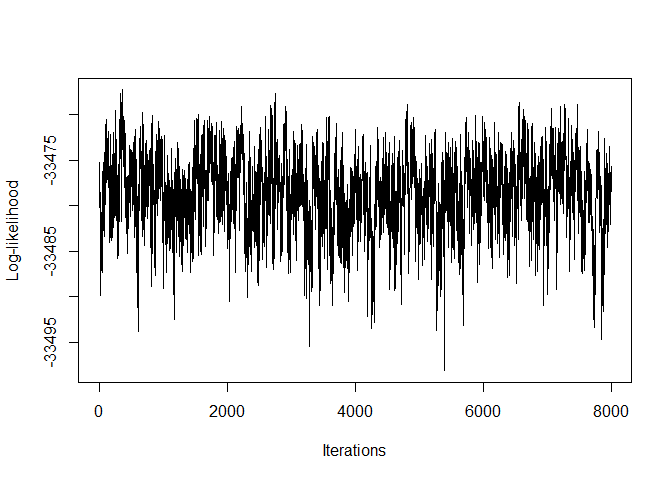

<!-- README.md is generated from README.Rmd. Please edit that file -->

# RGM

<!-- badges: start -->
<!-- badges: end -->

## Intended use of the package

<<<<<<< HEAD
This R-package will estimate the protein-protein interactions and the
protein-DNA interactions for a given dataset of protein and DNA
expressions and then make a graph connecting them. The package can
estimate the graph structure for both individual level data and summary
level data both when Spike and Slab or Threshold priors are assumed on
the interaction parameters. The package includes various helper
functions to generate posterior samples. It has a single primary
function that, based on these posterior samples, will give estimations
of protein-protein interactions, protein-DNA interactions, and the graph
structure between them.
=======
For a given dataset of gene expressions and DNA expressions, this
R-package will estimate the gene-gene interactions and the gene-DNA
interactions and then create a graph connecting them. A spike and slab
prior is assumed for each interaction parameter based on our prior
knowledge to calculate posterior estimates of the interactions. The
package includes various helper functions that generate gibbs samples of
the parameter values for the prior distributions and interaction
parameter values based on other parameter values. The package have two
main functions that, using the gibbs estimates of these parameters
produced by the helper functions at each iteration, will provide
estimates of the values of gene-gene interactions and gene-DNA
interactions.
>>>>>>> ea10e2cb849308c33dc2b2f7c3f69e1e3a56145d

## Installation instructions

You can install RGM R package from GitHub with:

``` r

    install.packages("devtools")

    devtools::install_github("bitansa/RGM")
```

Once the RGM package is installed load the library in the R workspace.

``` r

     library("RGM")
```

## Example

<<<<<<< HEAD
We will give a small example to show the functionality of the function
RGM available in this package to calculate protein-protein interactions
and protein-DNA interactions for a given protein expressions and DNA
expressions dataset. First we simulate the dataset.
=======
We will give a small example to show the functionality of the two
functions RGM and RGM_cpp available in this package to calculate
gene-gene interactions and gene-DNA interactions for a given gene
expressions and DNA expressions dataset. RGM_cpp function is a bit
faster as it is written in Rcpp, but the functionality of both the
functions are same. First we simulate the dataset.
>>>>>>> ea10e2cb849308c33dc2b2f7c3f69e1e3a56145d

``` r

set.seed(9154)

# Number of datapoints
n = 10000

# Number of Genes and number of DNAs
p = 5
k = 6

# Indicator of which DNA affacts which gene
d = c(2, 1, 1, 1, 1)

# Initialize Protein-Protein interaction matrix
A = matrix(sample(c(-0.1, 0.1), p^2, replace = TRUE), p, p)

diag(A) = 0

# Make the network sparse
A[sample(which(A!=0), length(which(A!=0))/2)] = 0

# Initialize Protein-DNA interaction matrix
B = matrix(0, p, k)

# Initialize m
m = 1

# Calculate B matrix based on d vector
for (i in 1:p) {
  
  # Update ith row of B
  B[i, m:(m + d[i] - 1)] = 1
  
  # Update m
  m = m + d[i]
  
}

# Create variance-covariance matrix
Sigma = 1 * diag(p)

Mult_Mat = solve(diag(p) - A)

Variance = Mult_Mat %*% Sigma %*% t(Mult_Mat)

# Generate DNA expressions
X = matrix(runif(n * k, 0, 5), nrow = n, ncol = k)

Y = matrix(0, nrow = n, ncol = p)

# Generate Protein expressions data based on DNA data
for (i in 1:n) {

 Y[i, ] = MASS::mvrnorm(n = 1, Mult_Mat %*% B %*% X[i, ], Variance)

}

# Print Protein-Protein interactions and Protein-DNA interactions
A
#>      [,1] [,2] [,3] [,4] [,5]
#> [1,]  0.0 -0.1  0.0  0.0  0.1
#> [2,]  0.1  0.0 -0.1  0.1  0.1
#> [3,]  0.0 -0.1  0.0  0.0  0.1
#> [4,]  0.0 -0.1  0.0  0.0  0.0
#> [5,]  0.0  0.1  0.0  0.0  0.0
B
#>      [,1] [,2] [,3] [,4] [,5] [,6]
#> [1,]    1    1    0    0    0    0
#> [2,]    0    0    1    0    0    0
#> [3,]    0    0    0    1    0    0
#> [4,]    0    0    0    0    1    0
#> [5,]    0    0    0    0    0    1
```

We will now apply RGM based on individual level data, summary level data
and beta matrix to show its functionality.

``` r

# Apply RGM on individual level data with Threshold prior
Output1 = RGM(X = X, Y = Y, d = c(2, 1, 1, 1, 1), n = 10000, prior = "Threshold")

# Calculate summary level data
S_YY = t(Y) %*% Y / n
S_YX = t(Y) %*% X / n
S_XX = t(X) %*% X / n

# Apply RGM on summary level data for Spike and Slab Prior
Output2 = RGM(S_YY = S_YY, S_YX = S_YX, S_XX = S_XX,
           d = c(2, 1, 1, 1, 1), n = 10000, prior = "Spike and Slab")

# Calculate Beta and Sigma_Hat
# Centralize Data
Y = t(t(Y) - colMeans(Y))
X = t(t(X) - colMeans(X))

# Calculate S_XX
S_XX = t(X) %*% X / n

# Generate Beta matrix and Sigma_Hat
Beta = matrix(0, nrow = p, ncol = k)
Sigma_Hat = matrix(0, nrow = p, ncol = k)

for (i in 1:p) {

    for (j in 1:k) {

        fit = lm(Y[, i] ~ X[, j])

        Beta[i, j] =  fit$coefficients[2]

        Sigma_Hat[i, j] = sum(fit$residuals^2) / n

        }

}


# Apply RGM on S_XX, Beta and Sigma_Hat for Threshold Prior
Output3 = RGM(S_XX = S_XX, Beta = Beta, Sigma_Hat = Sigma_Hat,
           d = c(2, 1, 1, 1, 1), n = 10000, prior = "Threshold")
```

<<<<<<< HEAD
We get the protein-protein interactions from the outputs in the
=======
We get the Protein-Protein interactions from the outputs in the
>>>>>>> ea10e2cb849308c33dc2b2f7c3f69e1e3a56145d
following way:

``` r

Output1$A_Est
#>            [,1]        [,2]       [,3]      [,4]       [,5]
#> [1,] 0.00000000 -0.11217958  0.0000000 0.0000000 0.10763864
#> [2,] 0.09966057  0.00000000 -0.1121921 0.1013338 0.10902826
#> [3,] 0.00000000 -0.09569871  0.0000000 0.0000000 0.09815679
#> [4,] 0.00000000 -0.10163127  0.0000000 0.0000000 0.00000000
#> [5,] 0.00000000  0.09937876  0.0000000 0.0000000 0.00000000
Output2$A_Est
#>               [,1]       [,2]          [,3]          [,4]        [,5]
#> [1,]  0.000000e+00 -0.1121898  0.0007126215  0.0017492550 0.106671751
#> [2,]  1.003735e-01  0.0000000 -0.1112060626  0.1009869453 0.107712796
#> [3,] -1.203307e-03 -0.0947820  0.0000000000  0.0006679705 0.098436315
#> [4,] -1.004424e-03 -0.1060114 -0.0007559203  0.0000000000 0.008147522
#> [5,]  7.194997e-05  0.1013995 -0.0048433454 -0.0019436851 0.000000000
Output3$A_Est
#>              [,1]        [,2]         [,3]          [,4]       [,5]
#> [1,]  0.000000000 -0.08883670  0.040120833  0.0002479864 0.09484588
#> [2,]  0.111238520  0.00000000 -0.112466494  0.0979918705 0.13654403
#> [3,]  0.017839307 -0.09639138  0.000000000  0.0115520030 0.11941383
#> [4,] -0.004493015 -0.11286529  0.001508998  0.0000000000 0.01479235
#> [5,] -0.001400830  0.13178774  0.012319217 -0.0006026448 0.00000000
```

We get the graph structure between the proteins from the outputs in the
following way:

``` r

Output1$zA_Est
#>      [,1] [,2] [,3] [,4] [,5]
#> [1,]    0    1    0    0    1
#> [2,]    1    0    1    1    1
#> [3,]    0    1    0    0    1
#> [4,]    0    1    0    0    0
#> [5,]    0    1    0    0    0
Output2$zA_Est
#>      [,1] [,2] [,3] [,4] [,5]
#> [1,]    0    1    0    0    1
#> [2,]    1    0    1    1    1
#> [3,]    0    1    0    0    1
#> [4,]    0    1    0    0    0
#> [5,]    0    1    0    0    0
Output3$zA_Est
#>      [,1] [,2] [,3] [,4] [,5]
#> [1,]    0    1    1    0    1
#> [2,]    1    0    1    1    1
#> [3,]    1    1    0    1    1
#> [4,]    0    1    0    0    1
#> [5,]    0    1    1    0    0
```

<<<<<<< HEAD
We get the protein-DNA interactions from the outputs in the following
=======
We get the Protein-DNA interactions from the outputs in the following
>>>>>>> ea10e2cb849308c33dc2b2f7c3f69e1e3a56145d
way:

``` r

Output1$B_Est
#>           [,1]     [,2]      [,3]      [,4]      [,5]      [,6]
#> [1,] 0.9934932 1.008944 0.0000000 0.0000000 0.0000000 0.0000000
#> [2,] 0.0000000 0.000000 0.9968001 0.0000000 0.0000000 0.0000000
#> [3,] 0.0000000 0.000000 0.0000000 0.9983563 0.0000000 0.0000000
#> [4,] 0.0000000 0.000000 0.0000000 0.0000000 0.9989325 0.0000000
#> [5,] 0.0000000 0.000000 0.0000000 0.0000000 0.0000000 0.9979222
Output2$B_Est
#>           [,1]   [,2]      [,3]      [,4]      [,5]     [,6]
#> [1,] 0.9942857 1.0073 0.0000000 0.0000000 0.0000000 0.000000
#> [2,] 0.0000000 0.0000 0.9962037 0.0000000 0.0000000 0.000000
#> [3,] 0.0000000 0.0000 0.0000000 0.9988354 0.0000000 0.000000
#> [4,] 0.0000000 0.0000 0.0000000 0.0000000 0.9989547 0.000000
#> [5,] 0.0000000 0.0000 0.0000000 0.0000000 0.0000000 1.000813
Output3$B_Est
#>           [,1]     [,2]      [,3]      [,4]      [,5]      [,6]
#> [1,] 0.9896451 1.004278 0.0000000 0.0000000 0.0000000 0.0000000
#> [2,] 0.0000000 0.000000 0.9928131 0.0000000 0.0000000 0.0000000
#> [3,] 0.0000000 0.000000 0.0000000 0.9983159 0.0000000 0.0000000
#> [4,] 0.0000000 0.000000 0.0000000 0.0000000 0.9974936 0.0000000
#> [5,] 0.0000000 0.000000 0.0000000 0.0000000 0.0000000 0.9961619
```

We get the graph structure between the proteins and the DNAs from the
outputs in the following way:

``` r

Output1$zB_Est
#>      [,1] [,2] [,3] [,4] [,5] [,6]
#> [1,]    1    1    0    0    0    0
#> [2,]    0    0    1    0    0    0
#> [3,]    0    0    0    1    0    0
#> [4,]    0    0    0    0    1    0
#> [5,]    0    0    0    0    0    1
Output2$zB_Est
#>      [,1] [,2] [,3] [,4] [,5] [,6]
#> [1,]    1    1    0    0    0    0
#> [2,]    0    0    1    0    0    0
#> [3,]    0    0    0    1    0    0
#> [4,]    0    0    0    0    1    0
#> [5,]    0    0    0    0    0    1
Output3$zB_Est
#>      [,1] [,2] [,3] [,4] [,5] [,6]
#> [1,]    1    1    0    0    0    0
#> [2,]    0    0    1    0    0    0
#> [3,]    0    0    0    1    0    0
#> [4,]    0    0    0    0    1    0
#> [5,]    0    0    0    0    0    1
```

We can plot the log-likelihoods from the outputs in the following way:

``` r

plot(Output1$LL_Pst, type = 'l', xlab = "Iterations", ylab = "Log-likelihood", col = 'red')
```


``` r
plot(Output2$LL_Pst, type = 'l', xlab = "Iterations", ylab = "Log-likelihood", col = 'blue')
```


``` r
plot(Output3$LL_Pst, type = 'l', xlab = "Iterations", ylab = "Log-likelihood", col = 'green')
```



## References

Yang Ni. Yuan Ji. Peter Müller. “Reciprocal Graphical Models for
Integrative Gene Regulatory Network Analysis.” Bayesian Anal. 13 (4)
1095 - 1110, December 2018. <https://doi.org/10.1214/17-BA1087>
