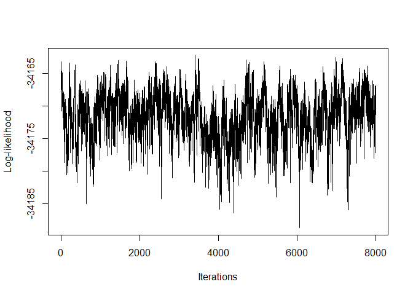

<!-- README.md is generated from README.Rmd. Please edit that file -->

# RGM

<!-- badges: start -->

[](https://github.com/bitansa/ReciprocalGraphicalModels/actions/workflows/R-CMD-check.yaml)
<!-- badges: end -->

## Intended use of the package

The RGM R package presents a crucial advancement in Mendelian
randomization (MR) studies, providing a robust solution to a common
challenge. While MR has proven invaluable in establishing causal links
between exposures and outcomes, its traditional focus on single
exposures and specific outcomes can be limiting. Biological systems
often exhibit complexity, with interdependent outcomes influenced by
numerous factors. RGM introduces a network-based approach to MR,
allowing researchers to explore the broader causal landscape.

With two available functions, RGM and NetworkMotif, the package offers
versatility in analyzing causal relationships. RGM primarily focuses on
constructing causal networks among response variables and between
responses and instrumental variables. On the other hand, NetworkMotif
specializes in quantifying uncertainty for given network structures
among response variables.

RGM accommodates both individual-level data and two types of
summary-level data, making it adaptable to various data availability
scenarios. This adaptability enhances the package’s utility across
different research contexts. The outputs of RGM include estimates of
causal effects, adjacency matrices, and other relevant parameters.
Together, these outputs contribute to a deeper understanding of the
intricate relationships within complex biological networks, thereby
enriching insights derived from MR studies.

## Installation instructions

You can install RGM R package from GitHub with:

``` r

    install.packages("devtools")

    devtools::install_github("bitansa/RGM")
```

Once the RGM package is installed load the library in the R workspace.

``` r

     library("RGM")
```

## Example

We offer a succinct demonstration of the capabilities of the RGM
function within the package, showcasing its effectiveness in computing
causal interactions among response variables and between responses and
instrumental variables using simulated datasets. Subsequently, we
provide an example of how NetworkMotif can be applied, utilizing a
specified network structure and Gamma_Pst acquired from executing the
RGM function.

``` r

# ModeL: Y = AY + BX + E

# Set seed
set.seed(9154)

# Number of datapoints
n = 10000

# Number of response variables and number of instrument variables
p = 5
k = 6

# Create d vector
d = c(2, 1, 1, 1, 1)

# Initialize causal interaction matrix between response variables
A = matrix(sample(c(-0.1, 0.1), p^2, replace = TRUE), p, p)

# Diagonal entries of A matrix will always be 0
diag(A) = 0

# Make the network sparse
A[sample(which(A!=0), length(which(A!=0))/2)] = 0

# Initialize causal interaction matrix between response and instrument variables
B = matrix(0, p, k)

# Initialize m
m = 1

# Calculate B matrix based on d vector
for (i in 1:p) {
 
  # Update ith row of B
  B[i, m:(m + d[i] - 1)] = 1
 
  # Update m
  m = m + d[i]
 
}

# Create variance-covariance matrix
Sigma = 1 * diag(p)

Mult_Mat = solve(diag(p) - A)

Variance = Mult_Mat %*% Sigma %*% t(Mult_Mat)

# Generate instrument data matrix
X = matrix(runif(n * k, 0, 5), nrow = n, ncol = k)

# Initialize response data matrix
Y = matrix(0, nrow = n, ncol = p)

# Generate response data matrix based on instrument data matrix
for (i in 1:n) {

 Y[i, ] = MASS::mvrnorm(n = 1, Mult_Mat %*% B %*% X[i, ], Variance)

}

# Print true causal interaction matrices between response variables and between response and instrument variables
A
#>      [,1] [,2] [,3] [,4] [,5]
#> [1,]  0.0 -0.1  0.0  0.0  0.1
#> [2,]  0.1  0.0 -0.1  0.1  0.1
#> [3,]  0.0 -0.1  0.0  0.0  0.1
#> [4,]  0.0 -0.1  0.0  0.0  0.0
#> [5,]  0.0  0.1  0.0  0.0  0.0
B
#>      [,1] [,2] [,3] [,4] [,5] [,6]
#> [1,]    1    1    0    0    0    0
#> [2,]    0    0    1    0    0    0
#> [3,]    0    0    0    1    0    0
#> [4,]    0    0    0    0    1    0
#> [5,]    0    0    0    0    0    1
```

We will now apply RGM based on individual level data, summary level data
and Beta, Sigma_Hat matrices to show its functionality.

``` r

# Apply RGM on individual level data with Threshold prior
Output1 = RGM(X = X, Y = Y, d = c(2, 1, 1, 1, 1), prior = "Threshold")

# Calculate summary level data
S_YY = t(Y) %*% Y / n
S_YX = t(Y) %*% X / n
S_XX = t(X) %*% X / n

# Apply RGM on summary level data for Spike and Slab Prior
Output2 = RGM(S_YY = S_YY, S_YX = S_YX, S_XX = S_XX,
           d = c(2, 1, 1, 1, 1), n = 10000, prior = "Spike and Slab")

# Calculate Beta and Sigma_Hat
# Centralize Data
Y = t(t(Y) - colMeans(Y))
X = t(t(X) - colMeans(X))

# Calculate S_XX
S_XX = t(X) %*% X / n

# Generate Beta matrix and Sigma_Hat
Beta = matrix(0, nrow = p, ncol = k)
Sigma_Hat = matrix(0, nrow = p, ncol = k)

for (i in 1:p) {

    for (j in 1:k) {

        fit = lm(Y[, i] ~ X[, j])

        Beta[i, j] =  fit$coefficients[2]

        Sigma_Hat[i, j] = sum(fit$residuals^2) / n

        }

 }


# Apply RGM on S_XX, Beta and Sigma_Hat for Threshold Prior
Output3 = RGM(S_XX = S_XX, Beta = Beta, Sigma_Hat = Sigma_Hat,
           d = c(2, 1, 1, 1, 1), n = 10000, prior = "Threshold")
```

We get the estimated causal interaction matrix between response
variables in the following way:

``` r

Output1$A_Est
#>            [,1]        [,2]       [,3]      [,4]       [,5]
#> [1,] 0.00000000 -0.11140615  0.0000000 0.0000000 0.10761964
#> [2,] 0.09927277  0.00000000 -0.1111652 0.1000334 0.10912908
#> [3,] 0.00000000 -0.09637386  0.0000000 0.0000000 0.09759288
#> [4,] 0.00000000 -0.10203596  0.0000000 0.0000000 0.00000000
#> [5,] 0.00000000  0.09928744  0.0000000 0.0000000 0.00000000
Output2$A_Est
#>              [,1]        [,2]          [,3]         [,4]       [,5]
#> [1,]  0.000000000 -0.11262237  0.0009547800  0.003000252 0.10640122
#> [2,]  0.100675105  0.00000000 -0.1121416975  0.100621628 0.10774403
#> [3,] -0.002229899 -0.09529822  0.0000000000  0.001269346 0.10016839
#> [4,] -0.003257993 -0.10542234 -0.0008876829  0.000000000 0.01154689
#> [5,]  0.001466929  0.10033516 -0.0072119898 -0.002885797 0.00000000
Output3$A_Est
#>              [,1]        [,2]         [,3]          [,4]       [,5]
#> [1,]  0.000000000 -0.08875307  0.041318383  0.0006178063 0.09498591
#> [2,]  0.111592403  0.00000000 -0.112605078  0.0985936916 0.13648932
#> [3,]  0.015711571 -0.09625968  0.000000000  0.0108548068 0.11935587
#> [4,] -0.004945287 -0.11303896  0.001301969  0.0000000000 0.01414149
#> [5,] -0.001858740  0.13134284  0.012553030 -0.0010936366 0.00000000
```

We get the estimated graph structure between the response variables in
the following way:

``` r

Output1$zA_Est
#>      [,1] [,2] [,3] [,4] [,5]
#> [1,]    0    1    0    0    1
#> [2,]    1    0    1    1    1
#> [3,]    0    1    0    0    1
#> [4,]    0    1    0    0    0
#> [5,]    0    1    0    0    0
Output2$zA_Est
#>      [,1] [,2] [,3] [,4] [,5]
#> [1,]    0    1    0    0    1
#> [2,]    1    0    1    1    1
#> [3,]    0    1    0    0    1
#> [4,]    0    1    0    0    0
#> [5,]    0    1    0    0    0
Output3$zA_Est
#>      [,1] [,2] [,3] [,4] [,5]
#> [1,]    0    1    1    0    1
#> [2,]    1    0    1    1    1
#> [3,]    1    1    0    1    1
#> [4,]    1    1    0    0    1
#> [5,]    0    1    1    0    0
```

We get the estimated causal interaction matrix between the response and
the instrument variables from the outputs in the following way:

``` r

Output1$B_Est
#>           [,1]     [,2]     [,3]      [,4]      [,5]      [,6]
#> [1,] 0.9935119 1.008009 0.000000 0.0000000 0.0000000 0.0000000
#> [2,] 0.0000000 0.000000 0.997496 0.0000000 0.0000000 0.0000000
#> [3,] 0.0000000 0.000000 0.000000 0.9998662 0.0000000 0.0000000
#> [4,] 0.0000000 0.000000 0.000000 0.0000000 0.9995511 0.0000000
#> [5,] 0.0000000 0.000000 0.000000 0.0000000 0.0000000 0.9982094
Output2$B_Est
#>           [,1]   [,2]      [,3]      [,4]      [,5]     [,6]
#> [1,] 0.9937211 1.0075 0.0000000 0.0000000 0.0000000 0.000000
#> [2,] 0.0000000 0.0000 0.9964755 0.0000000 0.0000000 0.000000
#> [3,] 0.0000000 0.0000 0.0000000 0.9990566 0.0000000 0.000000
#> [4,] 0.0000000 0.0000 0.0000000 0.0000000 0.9987975 0.000000
#> [5,] 0.0000000 0.0000 0.0000000 0.0000000 0.0000000 1.002271
Output3$B_Est
#>           [,1]     [,2]      [,3]      [,4]      [,5]      [,6]
#> [1,] 0.9901485 1.004256 0.0000000 0.0000000 0.0000000 0.0000000
#> [2,] 0.0000000 0.000000 0.9928381 0.0000000 0.0000000 0.0000000
#> [3,] 0.0000000 0.000000 0.0000000 0.9985674 0.0000000 0.0000000
#> [4,] 0.0000000 0.000000 0.0000000 0.0000000 0.9975018 0.0000000
#> [5,] 0.0000000 0.000000 0.0000000 0.0000000 0.0000000 0.9963616
```

We get the estimated graph structure between the response and the
instrument variables from the outputs in the following way:

``` r

Output1$zB_Est
#>      [,1] [,2] [,3] [,4] [,5] [,6]
#> [1,]    1    1    0    0    0    0
#> [2,]    0    0    1    0    0    0
#> [3,]    0    0    0    1    0    0
#> [4,]    0    0    0    0    1    0
#> [5,]    0    0    0    0    0    1
Output2$zB_Est
#>      [,1] [,2] [,3] [,4] [,5] [,6]
#> [1,]    1    1    0    0    0    0
#> [2,]    0    0    1    0    0    0
#> [3,]    0    0    0    1    0    0
#> [4,]    0    0    0    0    1    0
#> [5,]    0    0    0    0    0    1
Output3$zB_Est
#>      [,1] [,2] [,3] [,4] [,5] [,6]
#> [1,]    1    1    0    0    0    0
#> [2,]    0    0    1    0    0    0
#> [3,]    0    0    0    1    0    0
#> [4,]    0    0    0    0    1    0
#> [5,]    0    0    0    0    0    1
```

We can plot the log-likelihoods from the outputs in the following way:

``` r

plot(Output1$LL_Pst, type = 'l', xlab = "Iterations", ylab = "Log-likelihood", col = 'orange')
```


``` r
plot(Output2$LL_Pst, type = 'l', xlab = "Iterations", ylab = "Log-likelihood", col = 'purple')
```



``` r
plot(Output3$LL_Pst, type = 'l', xlab = "Iterations", ylab = "Log-likelihood", col = 'cyan')
```


Next, we present the implementation of the NetworkMotif function. We
begin by defining the true network structure among the response
variables. Subsequently, we collect Gamma_Pst arrays from various
outputs and proceed to execute NetworkMotif based on these arrays.

``` r

# Get the true network structure
Gamma = (A != 0) * 1

# Store the Gamma_Pst arrays from outputs
Gamma_Pst1 = Output1$Gamma_Pst
Gamma_Pst2 = Output2$Gamma_Pst
Gamma_Pst3 = Output3$Gamma_Pst

# Do uncertainty quantification with these Gamma_Pst matrices
NetworkMotif(Gamma = Gamma, Gamma_Pst = Gamma_Pst1)
#> [1] 1
NetworkMotif(Gamma = Gamma, Gamma_Pst = Gamma_Pst2)
#> [1] 0.006
NetworkMotif(Gamma = Gamma, Gamma_Pst = Gamma_Pst3)
#> [1] 0
```

## References

Yang Ni. Yuan Ji. Peter Müller. “Reciprocal Graphical Models for
Integrative Gene Regulatory Network Analysis.” Bayesian Anal. 13 (4)
1095 - 1110, December 2018. <https://doi.org/10.1214/17-BA1087>
