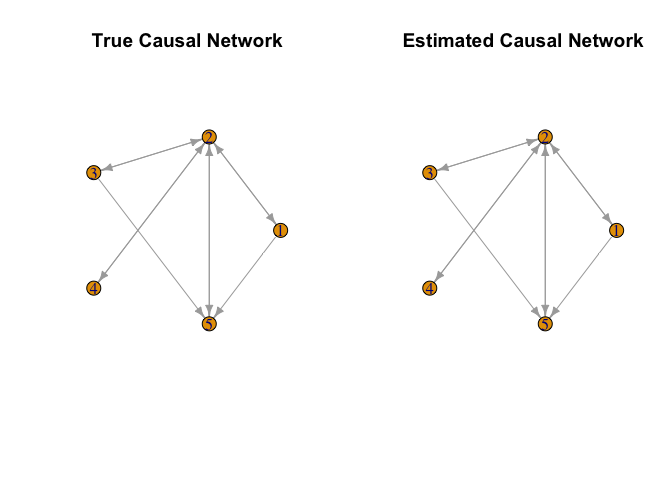

<!-- README.md is generated from README.Rmd. Please edit that file -->

# ReciprocalGraphicalModels

<!-- badges: start -->
<!-- badges: end -->

## Intended use of the package

For a given dataset of gene expressions and DNA expressions, this
R-package will estimate the gene-gene interactions and the gene-DNA
interactions and then create a graph connecting them. A spike and slab
prior is assumed for each interaction parameter based on our prior
knowledge to calculate posterior estimates of the interactions. The
package includes various helper functions that generate gibbs samples of
the parameter values for the prior distributions and interaction
parameter values based on other parameter values. The package have two
main functions that, using the gibbs estimates of these parameters
produced by the helper functions at each iteration, will provide
estimates of the values of gene-gene interactions and gene-DNA
interactions.

## Installation instructions

You can install ReciprocalGraphicalModels R package from GitHub with:

``` r

    install.packages("devtools")

    devtools::install_github("bitansa/ReciprocalGraphicalModels")
```

Once the ReciprocalGraphicalModels library is installed load the library
in the R workspace.

``` r

    library("ReciprocalGraphicalModels")
```

## Example

We will give a small example to show the functionality of the two
functions RGM and RGM_cpp available in this package to calculate
gene-gene interactions and gene-DNA interactions for a given gene
expressions and DNA expressions dataset. RGM_cpp function is a bit
faster as it is written in Rcpp, but the functionality of both the
functions are same. First we simulate the dataset.

``` r

set.seed(500)

# Number of datapoints
n = 500

# Number of Genes and number of DNAs
p = 3
k = 3

# Initialize gene-gene interaction matrix
A = matrix(sample(c(-3, 3), p^2, replace = TRUE), p, p)

# Diagonal entries of A matrix will always be 0
diag(A) = 0

# Initialize gene-DNA interaction matrix
B = matrix(0, p, k)

for(i in 1:p){

  B[i, i] = sample(c(-3, 3), 1, replace = TRUE)

}

# Indicator matrix for gene-DNA interaction
D = diag(3)

Sigma = 0.5 * diag(p)

Mult_Mat = solve(diag(p) - A)

Variance = Mult_Mat %*% Sigma %*% t(Mult_Mat)

# Generate DNA expressions
X = matrix(runif(n * k, 0, 5), nrow = n, ncol = k)

Y = matrix(0, nrow = n, ncol = p)

# Generate Gene expressions data based on DNA data
for (i in 1:n) {

 Y[i, ] = MASS::mvrnorm(n = 1, Mult_Mat %*% B %*% X[i, ], Variance)

}
```

Now we will apply RGM and RGM_cpp to show their functionality

``` r

Output1 = RGM(X = X, Y = Y, A0 = A, B0 = B, D = D)

Output2 = RGM_cpp(X = X, Y = Y, A0 = A, B0 = B, D = D)
```

From the outputs we can get the gene-gene interactions in the following
way:

``` r

Output1$A
#>           [,1]      [,2]      [,3]
#> [1,]  0.000000 -3.101907 -3.131141
#> [2,] -2.941582  0.000000  2.926206
#> [3,] -2.851565 -2.885388  0.000000

Output2$A
#>           [,1]      [,2]      [,3]
#> [1,]  0.000000 -2.988235 -2.971508
#> [2,] -2.998298  0.000000  3.004796
#> [3,] -2.948391 -2.964876  0.000000
```

From the outputs we can get the gene-DNA interactions in the following
way:

``` r

Output1$B
#>        [,1]     [,2]    [,3]
#> [1,] 3.0959 0.000000 0.00000
#> [2,] 0.0000 2.956539 0.00000
#> [3,] 0.0000 0.000000 2.86545

Output2$B
#>          [,1]    [,2]     [,3]
#> [1,] 3.006592 0.00000 0.000000
#> [2,] 0.000000 2.99175 0.000000
#> [3,] 0.000000 0.00000 2.939397
```

We can also plot the log-likelihood to check the convergence of the
model in the following way:

``` r

plot(1:length(Output1$LL), Output1$LL, xlab = "Iterations", ylab = "Log-likelihood", type = 'l', main = "Loglikelihood plot VS Iterations")
```



``` r

plot(1:length(Output2$LL), Output2$LL, xlab = "Iterations", ylab = "Log-likelihood", type = 'l', main = "Loglikelihood plot VS Iterations")
```


Here in both the functions we have taken the initial starting point for
A and B matrices to be the true A and B and hence the convergence the
really fast. If we don’t give any starting point for A and B or start
with some random A and B a lot of iterations may be needed to reach
convergence.

## Refrences

Yang Ni. Yuan Ji. Peter Müller. “Reciprocal Graphical Models for
Integrative Gene Regulatory Network Analysis.” Bayesian Anal. 13 (4)
1095 - 1110, December 2018. <https://doi.org/10.1214/17-BA1087>
